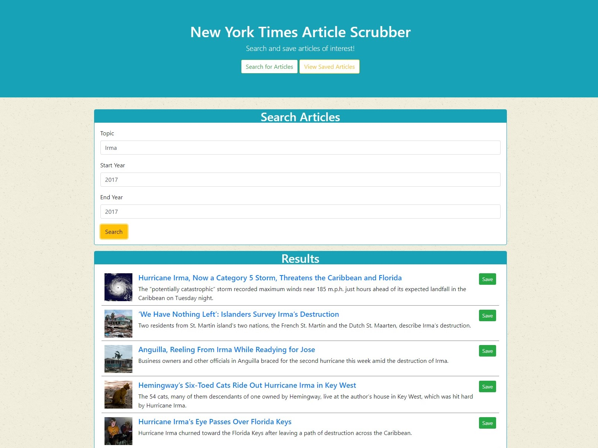

# NYT-React-App
News app using New York Times API

## Overview
A single page app that allows users search for articles in the New York Times API and save articles to a MongoDB database.

## On Load Screen

## Functionality
This page is built with `React` and uses the `New York Times API`.

## Screenshots

### Seaching for Articles

### Saved Articles

## Tech used

`HTML`, `CSS`, `Bootstrap`, `JavaScript`, `React`, `React-Router`, `Node.js`, `Express`, `MongoDB`, `Mongoose`, `Babel`, `Webpack`

## Authors
*Rutgers Codding Bootcamp Project*
* **Joseph Ball** - [josephtball](https://github.com/josephtball)